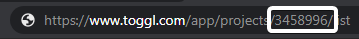
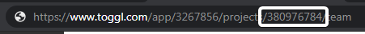

  

  
  
  
  

  Hassle-free time tracking using the <a href="https://www.elgato.com/en/gaming/stream-deck">Elgato Stream Deck</a> 
  and <a href="https://toggl.com/">Toggl</a>.

___

# ✏️ Setup

* **Entry Name** describes the activity you want to report. It is not required but strongly recommended.
* **API Token** is your private API Token you can get from your [Toggl profile](https://www.toggl.com/app/profile). Required.
* **Workspace ID** is the id of your workspace. You can usually find it in the URL. Required.

* **Project ID** is the id of the project you want to assign the task to. You can find it in the URL after clicking on a project in the [Toggl project view](https://www.toggl.com/app/projects/).

# 📞 Help

Feel free to ask your questions on [my Discord Server](https://discord.gg/YWy3UAy). Please use GitHub Issues for reporting bugs and requesting new features.

# 📄 License

streamdeck-toggl is licensed under the [MIT License](LICENSE).