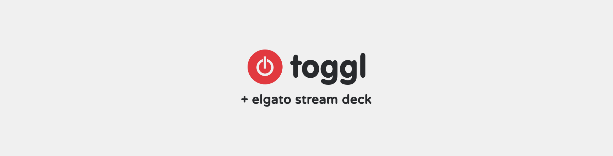
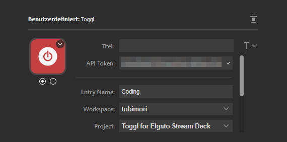
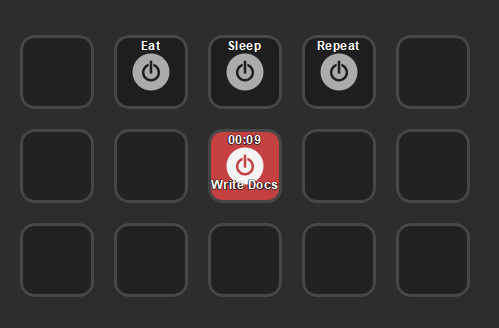

## ⚠️ API V8 Depreciation 
You may have received an email from toggl, stating you are using the v8 Api, which this plugin previously used. As per <https://github.com/tobimori/streamdeck-toggl/issues/41>, this issue has been fixed. Unfortunatley, these changes cannot be published to the elgato store. To workaround this issue conduct the following:

* Download the zipped code from this repository
  1. *Windows* - navigate to `%appdata%\Elgato\StreamDeck\Plugins\io.moeritz.streamdeck.toggl.sdPlugin`
  2. *MacOS* - navigate to `~/Library/Application Support/com.elgato.StreamDeck/Plugins/io.moeritz.streamdeck.toggl.sdPlugin` 
* Delete all the contents in this directory, and replace with the downloaded code from this repository.

> ## **⏸ Development ended - open to handover project**
> 
> Unfortunately, I am lacking time and energy to actively uphold development of this plugin. It still works with its bugs and quirks, but I will archive the plugin as-is for the time being. If anyone would like to take over and continue the development of this plugin, I'd be very happy - please get in touch.

  

  
  
  
  
  
  

___

# Hassle-free time tracking using [Elgato Stream Deck](https://www.elgato.com/en/gaming/stream-deck) and [Toggl Track](https://toggl.com/track/)

## ✏️ Setup

Just search for the Action "Toggl" within the Stream Deck app and install it. There is a button called "Toggl" available in section "Custom".

* **Title** is a default Stream Deck property available for every button in Stream Deck. You should leave it empty (see Button Label).
* **API Token** is your private API Token you can get from your [Toggl profile](https://track.toggl.com/profile). This Token is handled like a password. ***Don't share it***. Required.
* **Button Label** is used instead of *Title*. If the tracker isn't running, the Label is shown on the button. If the tracker is running the elapsed time is shown additionally. If *Title* is set, it will override *Button Label*.
* **Entry Name** describes the activity you want to report. It is not required but strongly recommended.
* **Workspace** is your workspace you start the time entries in. Required.
* **Project** is the project you want to assign the task to. Leave blank for no project. New projects can be added in Toggl.
* **Billable** sets Toggl's billable flag (for Toggl paid plans only).

Just press any Toggl Button to start tracking time. The button should indicate tracking by turning red and showing the current tracking time (if no *Title* is set). The status of the button is defined by workspace, project and entry name. If you setup two identical buttons (even on different Stream Deck profiles), both button indicate the same. If you start or stop your timer using the Toggl app (web, desktop, mobile) Toggl for Stream Deck will follow by changing the status.

## 📞 Help

Feel free to ask your questions on [my Discord Server](https://discord.gg/YWy3UAy). Please use GitHub Issues for reporting bugs and requesting new features.

## 📄 License

streamdeck-toggl is licensed under the [MIT License](LICENSE).

## Known Issues

* Changing the *Button Label* wont change the *Title* immediately. Restart Stream Deck.
